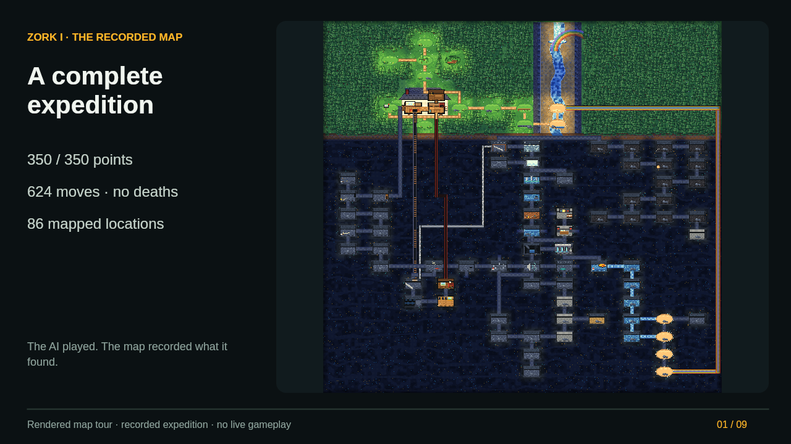

# CAS Zork Expedition

An interactive record of an AI-played Zork I expedition: **350/350 points, 624
moves, no deaths, 86 rooms and 94 connections**. Explore the pixel-art world,
walk its 3D reconstruction, inspect the schematic or ASCII map, and replay the
order in which locations were discovered.

The expedition stopped in the Living Room before the barrow ending. This is a
map and recorded playthrough, not a playable game or interpreter. Map controls
do not access or change the original game save.

**Status:** private review candidate, October 7, 2026. Automated tests and
builds pass. Braden confirmed that 3D works in his browser; this is a user
smoke-check, not a complete cross-browser UI audit. See [QA.md](QA.md).
Public release and the original-code license remain undecided.

## Open the map

The review repository and archive include [`out/map.html`](out/map.html). Open it in a modern browser. It is
one self-contained file: no server, account, game installation, or network
connection is needed. The 3D view requires WebGL; World, ASCII and Chart remain
available when WebGL cannot start. System fonts are used without remote font
requests.

## Build from source

Python 3.10+ is sufficient with the committed JavaScript bundle:

```sh
python3 tools/build.py
```

This writes `out/map.html` in this project only. It does not write to another
checkout or update a game save. For an intentional second copy, use
`python3 tools/build.py --live-copy /your/path/map.html` or set
`ZORK_LIVE_COPY`. `--no-live` and the legacy `ZORK_NO_LIVE` variable disable that
optional copy. Run `python3 tools/build.py --help` for output options.

For changes to `3d/src/`, use Node.js 20+ and npm:

```sh
cd 3d
npm ci
npm run bundle
cd ..
python3 tools/build.py
```

Or run `sh 3d/rebuild.sh` after installing dependencies. The lockfile pins the
build and test dependencies; `node_modules` is not part of the release.

## Controls

- **World / 3D / ASCII / Chart:** switch map views
- **Click a room:** inspect its notes, items, exits and illustration
- **+ / −, Fit, Find me:** change the view or return to the saved checkpoint
- **Replay / slider:** reveal rooms in discovery order, not a turn-by-turn game replay
- **Log / Items / Puzzles / Sketchbook:** explore the expedition's records
- **3D:** drag to orbit, scroll to zoom, click a discovered room to walk there,
  or use exit buttons. WASD/arrows move relative to the camera; Q/E move up/down.
  Night changes lighting; Drift rotates the camera; Retrace follows the saved route.

Auto-refresh appears only when opening a local file and is off by default.
Refresh/navigation saves the current view in tab-local session storage. Reduced
motion disables automatic pixel-world animation and shortens camera transitions.

## Validate

```sh
python3 tools/validate.py
python3 -m unittest discover -v
cd 3d
npm ci
npm test
```

The Python suite covers build failures, atomic output, state/layout references,
route directionality, every room-pair shortest path, and checkpoint helpers. The
JavaScript suite covers the actual explorer/layout code and UI/controller
behavior. DOM tests use native 2D canvas drawing; WebGL controller tests replace
only the renderer. These are functional tests, not evidence of browser layout,
GPU compatibility, mobile rendering, or actual mouse/keyboard usability.

## Walkthrough

[ROUTE.md](ROUTE.md) contains the original written route and mistakes learned
from the run. [WALKTHROUGH.md](WALKTHROUGH.md) explains the accompanying
[72-second captioned video](media/zork-map-walkthrough.mp4) and gives an interactive demo sequence.



To regenerate the **silent rendered map tour** with FFmpeg installed:

```sh
cd 3d
npm ci
npm run walkthrough
```

Output is under `out/walkthrough/`: MP4, preview, chapter images, original pixel
canvas, and transcript. The video uses the app's original drawing code. It is
not a browser screen recording and does not demonstrate the WebGL view.

## Project layout

- `state.json`: recorded checkpoint, rooms, exits, route and events
- `layout.json`: visual layout overrides
- `art/`: 37 room ASCII illustrations
- `template.html`, `js/`: page and pixel-map source, plus the committed 3D bundle
- `3d/src/`: editable Three.js scene and movement code
- `tools/`: portable build, validation, route and checkpoint utilities
- `tests/`, `3d/tests/`: regression suites
- `commands.log`: original command history, without raw game replies
- `MANIFEST.json`: hashes of files in this review archive

`python3 tools/route.py --list` lists room IDs. For example:
`python3 tools/route.py living-room kitchen`. This finds a shortest path over
the recorded graph; boat routes and conditional passages are not guaranteed
playable commands for a different game state.

## Attribution and publication

The original expedition was played through the CAS Agent at the Cloud & AI
Summit. CAS attribution is historical; this package does not include the CAS
application, account access, commercial assets, a game binary, or an interpreter.

Third-party notices are in [THIRD_PARTY_NOTICES.md](THIRD_PARTY_NOTICES.md) and
embedded in the standalone HTML. No license has been selected for the original
application code or artwork. See [RELEASE_REVIEW.md](RELEASE_REVIEW.md) before
public release. This private review candidate retains historical personal/CAS attribution and command history.
Account-specific resumption instructions have been removed from both source
and generated HTML. Public publication and an original-code license remain
pending owner approval.
